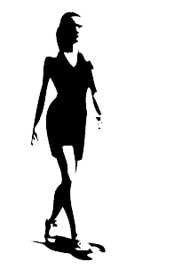

<p align="center">
<a href ="https://github.com/joeyguo/studiojs"></a>
</p>
<p align="center">
简单的、渐进式的 2D 渲染引擎(专注于帧动画)
</p>
<p align="center">
<a href="https://www.npmjs.org/package/studiojs"></a>
<a href="https://github.com/joeyguo/studiojs#license"></a>
</p>

--- 

# studiojs

[studiojs](https://github.com/joeyguo/studiojs) 是一款专注于帧动画的、简单的、渐进式的 2D 渲染引擎。

主要包含类： Frame、Track、Stage。 可独立使用、组合使用。

查看 [API 使用文档](./docs/README.md)

推荐使用 gka 一键生成数据，[gka](https://github.com/gkajs/gka)、[gka-tpl-studiojs](https://github.com/gkajs/gka-tpl-studiojs) 

# Install

```
npm install studiojs
```

or use CDN 

- https://unpkg.com/studiojs/dist/studiojs.min.js

# Usage

## Frame

Frame 是帧动画的基础单位，声明帧动画的播放内容。

示例: 使用 Frame 播放单个帧动画

```js
var Frame = studiojs.Frame,
    canvas = document.getElementById('myCanvas');

var data = {
    images: [img],
    frames: [
        // x, y, width, height, offX*, offY*, imageIndex*
        [355, 0, 86, 282, 34, 9],
        [853, 27, 79, 76, 37, 9],
        // etc.
    ],
    animations: {
        forward: ["0-24"],
        back: ["24-0"],
    }
};

var material = new Frame(data, "forward", 20, canvas);

setInterval(()=> {
    material.update();
}, 16);

```

   [示例完整代码](./example/frame-sprites)、[使用gka一键生成示例代码](./example/gka-data-frame)

## Track

轨道，能够加入多个 Frame，使其排队顺序播放

示例： 使用 Track + Frame 顺序排队播放多个帧动画

```js
var track = new Track(canvas);

var material1 = new Frame(data, 'forward'),
    material2 = new Frame(data, 'back');

track.add([material1, material2]);

setInterval(()=> {
    track.update();
}, 16);

```
  [示例完整代码](./example/track-sprites)

## Stage

舞台，能够包含多个 Track，各个 Track 并列播放, 合并展示

示例： 使用 Stage + Track + Frame 并列播放 Track

```js
var stage = new Stage(canvas)
var track1 = new Track(),
    track2 = new Track();

stage.add([track1, track2]);

//  ...

track1.add([material1, material2]);
track2.add([material3, material4]);

setInterval(()=> {
    stage.update();
}, 16);

```
  [示例完整代码](./example/track-sprites)

# Welcome

* 欢迎 Pull requests、Issues 一般在24小时内处理
* 讨论与咨询请+QQ 3201590286  :D

# License

[MIT](./LICENSE) 

Copyright (c) 2017 - present, joeyguo

